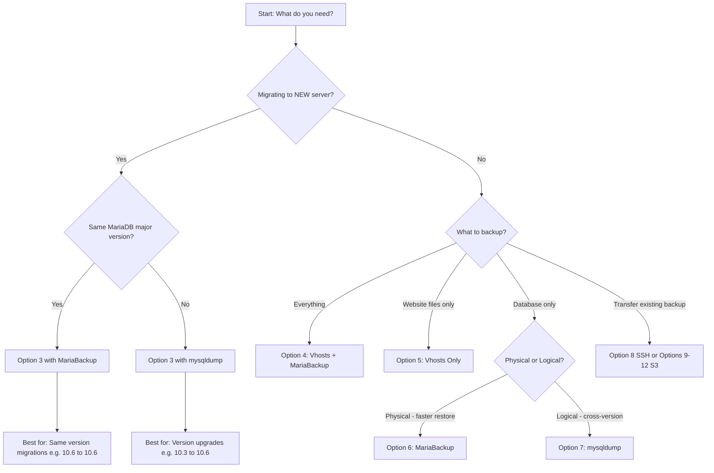
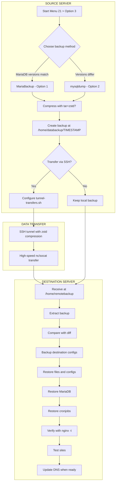

# Centmin Mod User Guide: centmin.sh Menu Option 21

This guide provides a comprehensive overview of centmin.sh menu option 21 in Centmin Mod, which focuses on data management tasks. You'll learn about the available menu and submenu options, as well as their functionalities. The underlying `backups.sh` script used has its own documentation [here](https://github.com/centminmod/centminmod/blob/141.00beta01/datamanagement/backups.sh.md). If you appreciate the work and effort, please consider [supporting Centmin Mod](https://community.centminmod.com/threads/ways-to-support-centmin-mod.11435/). Shorten url to [PayPal donation link](https://centminmod.com/donate/).

---

## Quick Start Guide

> **TL;DR**: This section provides experienced users with everything needed to get started quickly.

### 1.1 Prerequisites Checklist

Before using menu option 21, verify these requirements:

| Requirement                                 | Verification Command                        | Expected Result                     |
| ------------------------------------------- | ------------------------------------------- | ----------------------------------- |
| CSF Firewall whitelist (source server)      | `csf -a REMOTE_IP`                          | IP added to allow list              |
| CSF Firewall whitelist (destination server) | `csf -a SOURCE_IP`                          | IP added to allow list              |
| SSH key authentication                      | `ssh -i /root/.ssh/my1.key root@REMOTE_IP`  | Successful login without password   |
| AWS CLI installed (for S3)                  | `aws --version`                             | Version number displayed            |
| Sufficient disk space                       | `df -h /home`                               | At least 2x backup size available   |
| MariaDB running                             | `systemctl status mariadb`                  | Active (running)                    |

### 1.2 Quick Command Reference

| Task                                   | Command                                                                                                           |
| -------------------------------------- | ----------------------------------------------------------------------------------------------------------------- |
| **Full backup (Vhosts + MariaBackup)** | `backups.sh backup-all-mariabackup comp`                                                                          |
| **Vhosts only backup**                 | `backups.sh backup-files comp`                                                                                    |
| **MariaBackup only**                   | `backups.sh backup-mariabackup comp`                                                                              |
| **mysqldump only**                     | `backups.sh backup-all comp`                                                                                      |
| **Transfer via SSH**                   | `tunnel-transfers.sh -p 22 -u root -h REMOTE_IP -m nc -s /path/to/backup -r /destination -k /root/.ssh/my1.key`   |
| **Upload to S3**                       | `aws s3 sync --profile PROFILE --endpoint-url ENDPOINT /path/to/backup s3://BUCKET/`                              |
| **Restore MariaDB**                    | `mariabackup-restore.sh copy-back /path/to/mariadb_tmp/`                                                          |

> **Note**: All backup scripts are located at `/usr/local/src/centminmod/datamanagement/`

### 1.3 Decision Guide: Which Backup Method Should I Use?



### 1.4 Backup Type Comparison

| Feature                        | MariaBackup (Option 4/6)     | mysqldump (Option 7)                |
| ------------------------------ | ---------------------------- | ----------------------------------- |
| **Backup Speed**               | Fast (physical copy)         | Slower (logical dump)               |
| **Restore Speed**              | Fast                         | Slower                              |
| **Cross-Version Compatible**   | No (same major version only) | Yes                                 |
| **Includes Users/Permissions** | Yes (full MySQL system)      | Per-database only                   |
| **File Size**                  | Larger (full datadir)        | Smaller (SQL text)                  |
| **Best For**                   | Same-version migrations      | Version upgrades, selective restore |

---

## Getting Started

If it's first time using centmin.sh menu option 21, you'd want to at least do the following:

1. **Whitelist IP addresses in CSF Firewall** on both source and destination Centmin Mod servers:
   - On source server: `csf -a REMOTE_IP_ADDRESS`
   - On destination server: `csf -a SOURCE_IP_ADDRESS`

2. **Set up SSH key authentication** via centmin.sh menu option 21, submenu option 1 `Manage SSH keys`:
   - Select [3. Create New SSH Key For Remote Host](#33-create-new-ssh-key-for-remote-host)
   - This enables unattended data transfers to remote servers

   > **Tip:** Ensure remote server supports root user SSH with a password for initial SSH key setup. Otherwise, if you're using an existing SSH key, you'll be prompted for the SSH private key path during the process.

3. **Configure S3 storage** (optional) via centmin.sh menu option 21, submenu option 2 `Manage AWS CLI S3 Profile Credentials`:
   - Select [3. Create New AWS CLI S3 Profile](#43-create-new-aws-cli-s3-profile)
   - This enables data transfers to S3-compatible storage providers

### For Server Migrations

If you're migrating all Centmin Mod data to a new server:

- Use **Submenu Option 3**: [Migrate Centmin Mod Data To New Centmin Mod Server](#5-submenu-option-3-migrate-centmin-mod-data-to-new-centmin-mod-server)
- This is essentially the same as [Submenu Option 4](#6-submenu-option-4-backup-nginx-vhosts-data--mariabackup-mysql-backups) with automatic transfer
- Restoration process is identical

> **Important:** Migrations aren't finalized until you change the domain's DNS records. You can perform test migrations on test remote servers until you're comfortable with the final move.

---

## Table of Contents

- [Menu Option 21: Data Management](#2-menu-option-21-data-management)
  - [At-a-Glance Quick Reference](#21-at-a-glance-quick-reference)
  - [Submenu Option 1: Manage SSH Keys](#3-submenu-option-1-manage-ssh-keys) — Create, register, rotate, and manage SSH keys
    - [3.1 List Registered SSH Keys](#31-list-registered-ssh-keys)
    - [3.2 Register Existing SSH Keys](#32-register-existing-ssh-keys)
    - [3.3 Create New SSH Key For Remote Host](#33-create-new-ssh-key-for-remote-host)
    - [3.4 Use Existing SSH Key For Remote Host](#34-use-existing-ssh-key-for-remote-host)
    - [3.5 Rotate Existing SSH Key For Remote Host](#35-rotate-existing-ssh-key-for-remote-host)
    - [3.6 Delete Existing SSH Key For Remote Host](#36-delete-existing-ssh-key-for-remote-host)
    - [3.7 Export Existing SSH Key](#37-export-existing-ssh-key)
    - [3.8 Backup All Existing SSH Keys](#38-backup-all-existing-ssh-keys)
    - [3.9 Enable Root Login on Remote OVH/Cloud VPS](#39-enable-root-login-on-remote-ovhcloud-vps)
    - [3.10 Back to Main Menu](#310-back-to-main-menu)
  - [Submenu Option 2: Manage AWS CLI S3 Profile Credentials](#4-submenu-option-2-manage-aws-cli-s3-profile-credentials) — Configure S3-compatible storage
    - [4.1 List Registered AWS CLI S3 Profiles](#41-list-registered-aws-cli-s3-profiles)
    - [4.2 List AWS CLI S3 Profile Configuration](#42-list-aws-cli-s3-profile-configuration)
    - [4.3 Create New AWS CLI S3 Profile](#43-create-new-aws-cli-s3-profile)
    - [4.4 Edit Existing AWS CLI S3 Profile](#44-edit-existing-aws-cli-s3-profile)
    - [4.5 Delete Existing AWS CLI S3 Profile](#45-delete-existing-aws-cli-s3-profile)
    - [4.6 Export Existing AWS CLI S3 Profile](#46-export-existing-aws-cli-s3-profile)
    - [4.7 Backup All Existing AWS CLI S3 Profiles](#47-backup-all-existing-aws-cli-s3-profiles)
    - [4.8 Back to Main Menu](#48-back-to-main-menu)
  - [Submenu Option 3: Migrate Centmin Mod Data To New Centmin Mod Server](#5-submenu-option-3-migrate-centmin-mod-data-to-new-centmin-mod-server) — Complete server migration
    - [5.1 Pre-Migration Checklist](#51-pre-migration-checklist)
    - [5.2 Migration Workflow](#52-migration-workflow)
    - [5.3 Step-by-Step Guide](#53-step-by-step-guide)
    - [5.4 Example Run](#54-example-run)
    - [5.5 Command Line Usage](#54-command-line-usage)
  - [Submenu Option 4: Backup Nginx Vhosts Data + MariaBackup MySQL Backups](#6-submenu-option-4-backup-nginx-vhosts-data--mariabackup-mysql-backups) — Full backup with binary DB
    - [6.1 Backup Contents](#61-backup-contents)
    - [6.2 Restoration Guide](#62-restoration-guide)
    - [6.3 Command Line Usage](#63-command-line-usage)
  - [Submenu Option 5: Backup Nginx Vhosts Data Only](#7-submenu-option-5-backup-nginx-vhosts-data-only) — Website files only
    - [7.1 Command Line Usage](#71-command-line-usage)
  - [Submenu Option 6: Backup MariaDB MySQL With MariaBackup Only](#8-submenu-option-6-backup-mariadb-mysql-with-mariabackup-only) — Binary database backup
    - [8.1 Command Line Usage](#81-command-line-usage)
  - [Submenu Option 7: Backup MariaDB MySQL With mysqldump Only](#9-submenu-option-7-backup-mariadb-mysql-with-mysqldump-only) — SQL dump backup
    - [9.1 Command Line Usage](#91-command-line-usage)
  - [Submenu Option 8: Transfer Directory Data To Remote Server Via SSH](#10-submenu-option-8-transfer-directory-data-to-remote-server-via-ssh) — High-speed SSH transfer
    - [10.1 Required Information](#101-required-information)
    - [10.2 Example Session](#102-example-session)
    - [10.3 Remote Server Restoration](#103-remote-server-restoration)
    - [10.4 Command Line Usage](#104-command-line-usage)
  - [Submenu Option 9: Transfer Directory Data To S3 Compatible Storage](#11-submenu-option-9-transfer-directory-data-to-s3-compatible-storage) — S3 directory sync
    - [11.1 Command Line Usage](#111-command-line-usage)
  - [Submenu Option 10: Transfer Files To S3 Compatible Storage](#12-submenu-option-10-transfer-files-to-s3-compatible-storage) — S3 file upload
    - [12.1 Command Line Usage](#121-command-line-usage)
  - [Submenu Option 11: Download S3 Compatible Stored Data To Server](#13-submenu-option-11-download-s3-compatible-stored-data-to-server) — S3 download
    - [13.1 Command Line Usage](#131-command-line-usage)
  - [Submenu Option 12: S3 To S3 Compatible Storage Transfers](#14-submenu-option-12-s3-to-s3-compatible-storage-transfers) — Cross-S3 transfer
    - [14.1 Command Line Usage](#141-command-line-usage)
  - [Submenu Option 13: List S3 Storage Buckets](#15-submenu-option-13-list-s3-storage-buckets) — View S3 buckets
    - [15.1 Command Line Usage](#151-command-line-usage)
  - [Submenu Option 14: Back to Main Menu](#16-submenu-option-14-back-to-main-menu)
  - [Adding Custom Directories to Backup](#17-adding-custom-directories-to-backup)
- [S3 Provider Endpoint Reference](#18-s3-provider-endpoint-reference)
- [Command Line Reference](#19-command-line-reference)
- [Troubleshooting](#20-troubleshooting)
- [Recommended Backup Schedule](#21-recommended-backup-schedule)
- [Performance Benchmarks](#22-performance-benchmarks)

---

## 2. Menu Option 21: Data Management

When you select option 21 from the main Centmin Mod menu, you will access the `datamanager_menu` function.

```bash
--------------------------------------------------------
     Centmin Mod Data Management
--------------------------------------------------------
1).   Manage SSH Keys
2).   Manage AWS CLI S3 Profile Credentials
3).   Migrate Centmin Mod Data To New Centmin Mod Server
4).   Backup Nginx Vhosts Data + MariaBackup MySQL Backups
5).   Backup Nginx Vhosts Data Only (no MariaDB MySQL backups)
6).   Backup MariaDB MySQL With MariaBackup Only (no Vhosts Data backups)
7).   Backup MariaDB MySQL With mysqldump only (no Vhosts Data backups)
8).   Transfer Directory Data To Remote Server Via SSH
9).   Transfer Directory Data To S3 Compatible Storage
10).  Transfer Files To S3 Compatible Storage
11).  Download S3 Compatible Stored Data To Server
12).  S3 To S3 Compatible Storage Transfers
13).  List S3 Storage Buckets
14).  Back to Main menu
--------------------------------------------------------
Enter option [ 1 - 14 ]
--------------------------------------------------------
```

### 2.1 At-a-Glance Quick Reference

Use this table for quick lookup of all menu options and their purposes:

| Option | Name                       | Purpose                          | Includes                                               |
| :----: | -------------------------- | -------------------------------- | ------------------------------------------------------ |
| **1**  | Manage SSH Keys            | SSH key lifecycle management     | Create, register, rotate, delete, export, backup keys  |
| **2**  | Manage AWS CLI S3 Profiles | S3 storage credential management | Create, edit, delete, export, backup profiles          |
| **3**  | Migrate to New Server      | Complete server migration        | Backup + Transfer + Restore workflow                   |
| **4**  | Vhosts + MariaBackup       | Full backup with binary DB       | Nginx configs, vhosts, MariaDB (physical)              |
| **5**  | Vhosts Only                | Website files backup             | Nginx configs, vhost directories only                  |
| **6**  | MariaBackup Only           | Binary database backup           | MariaDB physical backup (same-version restore)         |
| **7**  | mysqldump Only             | SQL dump backup                  | MariaDB logical backup (cross-version compatible)      |
| **8**  | SSH Transfer               | High-speed data transfer         | zstd-compressed tunnel via nc/socat                    |
| **9**  | Directory to S3            | Sync directory to S3             | `aws s3 sync` to S3-compatible storage                 |
| **10** | Files to S3                | Upload files to S3               | `aws s3 cp` individual files                           |
| **11** | Download from S3           | Download S3 data                 | `aws s3 cp` from S3 to server                          |
| **12** | S3 to S3 Transfer          | Cross-S3 transfer                | Transfer between S3 providers/buckets                  |
| **13** | List S3 Buckets            | View S3 buckets                  | `aws s3 ls` for configured profiles                    |
| **14** | Back to Main Menu          | Exit data management             | Return to centmin.sh main menu                         |

This submenu provides various options related to data management, such as:

---

## 3. Submenu Option 1: Manage SSH Keys

```bash
--------------------------------------------------------
     Manage SSH Keys
--------------------------------------------------------
1).   List Registered SSH Keys
2).   Register Existing SSH Keys
3).   Create New SSH Key For Remote Host
4).   Use Existing SSH Key For Remote Host
5).   Rotate Existing SSH Key For Remote Host
6).   Delete Existing SSH Key For Remote Host
7).   Export Existing SSH Key
8).   Backup All Existing SSH Keys
9).   Enable Root Login on Remote OVH/Cloud VPS
10).  Back to Main menu
--------------------------------------------------------
Enter option [ 1 - 10 ]
--------------------------------------------------------
```

This option allows you to manage SSH keys for remote hosts. The available actions include:

1. List Registered SSH Keys
2. Register Existing SSH Keys
3. Create New SSH Key For Remote Host
4. Use Existing SSH Key For Remote Host
5. Rotate Existing SSH Key For Remote Host
6. Delete Existing SSH Key For Remote Host
7. Export Existing SSH Key
8. Backup All Existing SSH Keys
9. Enable Root Login on Remote OVH/Cloud VPS
10. Back to Main Menu

### 3.1 List Registered SSH Keys

This option lists all registered SSH keys on your system. There are no prompts for this option.

### 3.2 Register Existing SSH Keys

This option allows you to register an existing SSH key with a remote host. You will be prompted for the following information:

| Prompt           | Description                                                          |
| ---------------- | -------------------------------------------------------------------- |
| Private key path | Full path to the private key file (e.g., `/root/.ssh/id_ed25519`)    |
| Public key path  | Full path to the public key file (e.g., `/root/.ssh/id_ed25519.pub`) |

### 3.3 Create New SSH Key For Remote Host

This option creates a new SSH key and registers it with the specified remote host. You will be prompted for the following information:

| Prompt              | Description                           | Default   |
| ------------------- | ------------------------------------- | --------- |
| Key type            | `rsa`, `ecdsa`, or `ed25519`          | `ed25519` |
| Remote IP address   | IP address of the remote host         | —         |
| Remote SSH port     | SSH port number                       | `22`      |
| Remote SSH username | Username for remote connection        | `root`    |
| Key comment         | Unique identifier for the key         | —         |
| Remote SSH password | Password for initial setup (optional) | —         |

> **Tip:** Leave the password empty to enter it manually when prompted during key installation.

> **Cloud VPS Support:** For OVH, Hetzner, or other cloud VPS providers that disable root SSH login by default, this option will prompt whether you're connecting to a cloud VPS. If enabled, you can provide sudo user credentials (e.g., `almalinux`, `rocky`, `cloud-user`, `opc`) to copy the SSH key to root's authorized_keys via sudo.

### 3.4 Use Existing SSH Key For Remote Host

This option allows you to use an existing SSH key for a specified remote host. You will be prompted for:

| Prompt              | Description                       |
| ------------------- | --------------------------------- |
| Private key path    | Full path to the private key file |
| Remote IP address   | IP address of the remote host     |
| Remote SSH port     | SSH port number                   |
| Remote SSH username | Username for remote connection    |

> **Cloud VPS Support:** This option supports OVH/cloud VPS servers with root login disabled. When prompted, you can enable cloud VPS mode and provide sudo user credentials to copy the key via sudo authentication. You can also optionally enable PermitRootLogin using the sshd_config.d drop-in approach.

### 3.5 Rotate Existing SSH Key For Remote Host

This option replaces the existing SSH key for the specified remote host with a newly generated one. You will be prompted for:

| Prompt              | Description                    | Default     |
| ------------------- | ------------------------------ | ----------- |
| Key type            | `rsa`, `ecdsa`, or `ed25519`   | `ed25519`   |
| Remote IP address   | IP of remote host to update    | —           |
| Remote SSH port     | SSH port number                | `22`        |
| Remote SSH username | Username for remote connection | `root`      |
| Key comment         | Unique identifier for new key  | —           |
| Remote SSH password | Password (optional)            | —           |

> **Note:** For OVH/cloud VPS servers with root login disabled, use option 9 first to enable root login, then use this option to rotate keys.

### 3.6 Delete Existing SSH Key For Remote Host

This option deletes an existing SSH key for the specified remote host. You will be prompted for:

| Prompt                      | Description                    |
| --------------------------- | ------------------------------ |
| Remote IP address           | IP of remote host              |
| Remote SSH port             | SSH port number                |
| Remote SSH username         | Username for remote connection |
| Private key path (optional) | Path for SSH `-i` option       |

> **Cloud VPS Support:** This option supports deleting keys from OVH/cloud VPS servers with root login disabled using sudo user authentication.

### 3.7 Export Existing SSH Key

This option exports an existing SSH key to a specified file. You will be prompted for:

| Prompt           | Description                                  |
| ---------------- | -------------------------------------------- |
| Key name         | Unique identifier or comment of the SSH key  |
| Destination path | Full path for the exported key file          |

### 3.8 Backup All Existing SSH Keys

This option creates a backup of all existing SSH keys on your system. You will be prompted for:

| Prompt           | Description                                           |
| ---------------- | ----------------------------------------------------- |
| Destination path | Directory for SSH keys backup (created if not exists) |

### 3.9 Enable Root Login on Remote OVH/Cloud VPS

This option enables root SSH login on remote OVH or cloud VPS servers that have root login disabled by default. It uses the sshd_config.d drop-in file approach for safer configuration.

| Prompt              | Description                                                                      | Default |
| ------------------- | -------------------------------------------------------------------------------- | ------- |
| Remote IP address   | IP address of the remote VPS                                                     | —       |
| Remote SSH port     | SSH port number                                                                  | `22`    |
| Sudo username       | Cloud provider's default user (e.g., `almalinux`, `rocky`, `cloud-user`, `opc`)  | —       |
| Sudo user password  | Password for the sudo user                                                       | —       |
| New root password   | Password to set for root user                                                    | —       |

**How it works:**

1. Connects to the remote server using the sudo user credentials
2. Creates `/etc/ssh/sshd_config.d/01-permitrootlogin.conf` with `PermitRootLogin yes`
3. Sets the root password if provided
4. Restarts the sshd service

> **Note:** This approach uses the sshd_config.d drop-in directory rather than modifying `/etc/ssh/sshd_config` directly, making it non-destructive and easy to reverse by simply deleting the drop-in file.

**Supported sudo usernames by provider:**

| Provider                 | Default Sudo Username |
| ------------------------ | --------------------- |
| AlmaLinux Cloud Images   | `almalinux`           |
| Rocky Linux Cloud Images | `rocky`               |
| Oracle Linux             | `opc`                 |
| Generic Cloud Images     | `cloud-user`          |

### 3.10 Back to Main Menu

This option takes you back to the main Data Management menu.

---

## 4. Submenu Option 2: Manage AWS CLI S3 Profile Credentials

This option allows you to manage AWS CLI S3 profile credentials.

```bash
--------------------------------------------------------
     Manage AWS CLI S3 Profile Credentials
--------------------------------------------------------
1).   List Registered AWS CLI S3 Profiles
2).   List AWS CLI S3 Profile Configuration
3).   Create New AWS CLI S3 Profile
4).   Edit Existing AWS CLI S3 Profile
5).   Delete Existing AWS CLI S3 Profile
6).   Export Existing AWS CLI S3 Profile
7).   Backup All Existing AWS CLI S3 Profiles
8).   Back to Main menu
--------------------------------------------------------
Enter option [ 1 - 8 ]
--------------------------------------------------------
```

The available actions include:

1. List Registered AWS CLI S3 Profiles
2. List AWS CLI S3 Profile Configuration
3. Create New AWS CLI S3 Profile
4. Edit Existing AWS CLI S3 Profile
5. Delete Existing AWS CLI S3 Profile
6. Export Existing AWS CLI S3 Profile
7. Backup All Existing AWS CLI S3 Profiles
8. Back to Main Menu

### 4.1 List Registered AWS CLI S3 Profiles

This option lists all registered AWS CLI S3 profiles on your system. It will display the names of all available profiles that have been configured with the `aws configure` command.

### 4.2 List AWS CLI S3 Profile Configuration

This option displays the configuration details of a specified AWS CLI S3 profile. You will be prompted to enter the profile name, and then the script will display the Access Key, Secret Key, Default Region, and Default Output format associated with that profile.

### 4.3 Create New AWS CLI S3 Profile

This option allows you to create a new AWS CLI S3 profile by providing the necessary information:

| Prompt              | Description                                                                                       |
| ------------------- | ------------------------------------------------------------------------------------------------- |
| S3 storage provider | Provider type (AWS, Cloudflare R2, Backblaze, etc.)                                               |
| Profile name        | Unique name for this profile                                                                      |
| Endpoint URL        | S3-compatible endpoint (see [S3 Provider Endpoint Reference](#18-s3-provider-endpoint-reference)) |
| Access Key          | Your access key ID                                                                                |
| Secret Key          | Your secret access key                                                                            |
| Default Region      | Region code (e.g., `us-east-1`, `auto`)                                                           |
| Default Output      | Output format: `json`, `text`, or `yaml`                                                          |

The script will guide you through the process, and once the details are confirmed, the new profile will be created.

### 4.4 Edit Existing AWS CLI S3 Profile

This option allows you to edit the configuration of an existing AWS CLI S3 profile. You will be prompted to enter the profile name, and the script will display the current configuration settings. You can then choose a configuration option to edit:

- Max concurrent requests
- Multipart threshold
- Multipart chunk size
- Max bandwidth
- And more...

### 4.5 Delete Existing AWS CLI S3 Profile

This option enables you to delete an existing AWS CLI S3 profile. You will be prompted to enter the profile name to delete, and after confirming the details, the script will remove the profile from the configuration and credentials files.

### 4.6 Export Existing AWS CLI S3 Profile

This option allows you to export an existing AWS CLI S3 profile to separate configuration and credentials files. You will be prompted to enter the profile name to export, and after confirming the details, the script will create two files containing the exported profile configuration and credentials.

### 4.7 Backup All Existing AWS CLI S3 Profiles

This option enables you to create a backup of all existing AWS CLI S3 profiles on your system. The script will copy the configuration and credentials files to a specified backup directory, allowing you to restore the profiles later if needed.

### 4.8 Back to Main Menu

This option takes you back to the main Data Management menu.

---

## 5. Submenu Option 3: Migrate Centmin Mod Data To New Centmin Mod Server

> **TL;DR**: Complete server migration with backup + transfer. Uses either MariaBackup (same DB version) or mysqldump (different DB versions).

### 5.1 Pre-Migration Checklist

Before starting the migration, verify:

- [ ] Both servers have Centmin Mod installed
- [ ] CSF Firewall allows traffic between servers
- [ ] SSH key authentication is configured
- [ ] Sufficient disk space on both servers
- [ ] MariaDB versions documented on both servers
- [ ] Test migration planned (don't change DNS until verified)

### 5.2 Migration Workflow



### 5.3 Step-by-Step Guide

When using the "Migrate Centmin Mod Data To New Centmin Mod Server" option, you'll be prompted to enter the following information:

#### Step 1: Confirmation

- Confirm to continue with the migration process

#### Step 2: Backup Method Selection

| Option | Method      | When to Use                                                                |
| ------ | ----------- | -------------------------------------------------------------------------- |
| **1**  | MariaBackup | Both servers have the **same** MariaDB major version (e.g., 10.6 on both)  |
| **2**  | mysqldump   | Servers have **different** MariaDB versions (e.g., 10.3 → 10.6)            |

> **Recommendation:** If one server is on an older version, upgrade it to match before using MariaBackup.

#### Step 3: Compression Selection

- Option to use tar + zstd compression for the backup (recommended)

#### Step 4: Transfer Configuration

If you choose to transfer the backup directory to a remote server via SSH:

| Prompt                        | Description                     | Default       |
| ----------------------------- | ------------------------------- | ------------- |
| Remote server SSH port        | SSH port number                 | `22`          |
| Remote server SSH username    | Username                        | `root`        |
| Remote server SSH hostname/IP | IP address or hostname          | —             |
| Tunnel method                 | `nc` (netcat) or `socat`        | `nc`          |
| Buffer size                   | Bytes (e.g., 131072 for 128 KB) | `131072`      |
| Listen port                   | Port for tunnel                 | `12345`       |
| Source backup directory       | Local backup path               | Auto-detected |
| Remote backup directory       | Destination path                | —             |
| SSH private key path          | Path to key file                | —             |

After entering the required information, you'll be asked to confirm the details before proceeding.

#### Step 5: Restoration (on destination server)

If you chose MariaBackup (option 1), the restore process is the same as [Submenu Option 4](#6-submenu-option-4-backup-nginx-vhosts-data--mariabackup-mysql-backups). See that section for detailed restoration instructions.

> **Tip:** You can add custom directories to the backup by configuring `/etc/centminmod/backups.ini`. See [Adding Custom Directories to Backup](#17-adding-custom-directories-to-backup) section below.

### 5.4 Example Run

~~~
--------------------------------------------------------
      Centmin Mod Data Management        
--------------------------------------------------------
      Docs: https://centminmod.com/menu21-141.00beta01
--------------------------------------------------------
1).   Manage SSH Keys
2).   Manage AWS CLI S3 Profile Credentials
3).   Migrate Centmin Mod Data To New Centmin Mod Server
4).   Backup Nginx Vhosts Data + MariaBackup MySQL Backups
5).   Backup Nginx Vhosts Data Only (no MariaDB MySQL backups)
6).   Backup MariaDB MySQL With MariaBackup Only (no Vhosts Data backups)
7).   Backup MariaDB MySQL With mysqldump only (no Vhosts Data backups)
8).   Transfer Directory Data To Remote Server Via SSH
9).   Transfer Directory Data To S3 Compatible Storage
10).  Transfer Files To S3 Compatible Storage
11).  Download S3 Compatible Stored Data To Server
12).  S3 To S3 Compatible Storage Transfers
13).  List S3 Storage Buckets
14).  Back to Main menu
--------------------------------------------------------
Enter option [ 1 - 14 ] 3
--------------------------------------------------------

Migrate Centmin Mod Data To New Centmin Mod Server

Description:
This option is for full Nginx vhost data and MariaDB MySQL data transfers from
this server to a new Centmin Mod based server. There are specific requirements
for this to work:

1. The destination server must already have Centmin Mod LEMP stack installed
2. The destination server and this server's MairaDB MySQL server versions must
   be the same major version at least. i.e. MariaDB 10.3 or both

Do you want to continue [y/n]: y
~~~

Then when you continue choose how you want to backup the data and choice of MariaDB MySQL backup method. For speed of back and restoration, choose option 1, MariaBackup.

~~~
Choose the backup method:
1) Backup Nginx Vhosts Data + MariaBackup MySQL Backups
2) Backup Nginx Vhosts Data + Backup MariaDB MySQL With mysqldump

Enter the backup method (1 or 2): 1

Backup Nginx Vhosts Data + MariaBackup MySQL Backups

Description:
This option is for full Nginx vhost data and MariaDB MySQL backups using
tar + zstd compression is optional. If you choose not to use tar + zstd
the local backup directories will have uncompressed data backups.

Do you want to continue [y/n]: y
Do you want tar + zstd compress backup [y/n]: y
~~~

Once backup is complete, you can choose to transfer the backup data file `centminmod_backup.tar.zst` to remote server via SSH. Example run below shows transferring backup data to remote server via SSH.

~~~
[Fri Dec  5 23:50:38 UTC 2025] Cleaning up temporary directories ...
rm -rf /home/databackup/051225-223516/domains_tmp
rm -rf /home/databackup/051225-223516/mariadb_tmp
[Fri Dec  5 23:51:22 UTC 2025] Backup completed. File: /home/databackup/051225-223516/centminmod_backup.tar.zst
[Fri Dec  5 23:51:23 UTC 2025] Backup Log saved: /home/databackup/051225-223516/files-backup_051225-223516.log
[Fri Dec  5 23:51:23 UTC 2025] Script execution time: 4564 seconds

Backup Directory: /home/databackup/051225-223516

Do you want to transfer the backup directory to remote server via SSH? [y/n/exit]: y
~~~

When you answer yes to transfer the backup directory files to remote server via SSH and saved to remote server directory `/home/remotebackup` i.e. `/home/remotebackup/centminmod_backup.tar.zst`, you will be prompted for the following SSH transfer information:

~~~
Do you want to transfer the backup directory to remote server via SSH? [y/n/exit]: y

Transfer /home/databackup/051225-223516 Directory Data To Remote Server Via SSH

Description:
Option allows you to specify a full path to directory name for data transfer
to a remote server via SSH at speeds near network and disk line rates using
either netcat (nc) or socat compressed tunnel using zstd fast compression levels

Do you want to continue [y/n]: y
Remote server SSH port (default: 22): 22
Remote server SSH username (default: root): root
Remote server SSH hostname/IP address: 192.168.1.10
Tunnel method (nc or socat, default: nc): nc
Buffer size for socat (in bytes, e.g., 131072 for 128 KB): 131072
Listen port for nc or socat (default: 12345): 12345
Source backup directory: /home/databackup/051225-223516
Remote (destination) backup directory i.e. /home/remotebackup : /home/remotebackup
Path to the SSH private key i.e. /root/.ssh/my1.key : /root/.ssh/my1.key

Please confirm the entered information:
Remote server SSH port: 22
Remote server SSH username: root
Remote server SSH hostname/IP address: 192.168.1.10
Tunnel method: nc
Buffer size: 131072
Listen port: 12345
Source backup directory: /home/databackup/051225-223516
Remote (destination) backup directory: /home/remotebackup
Path to the SSH private key: /root/.ssh/my1.key

Is the information correct? [y/n]: y


csf -a 192.168.1.10 remotebackup
add failed: 192.168.1.10 is in already in the allow file /etc/csf/csf.allow

ssh -i /root/.ssh/my1.key -p 22 root@192.168.1.10 "csf -a 123.123.123.123 cmmbackupip"
add failed: 123.123.123.123 is in already in the allow file /etc/csf/csf.allow

/usr/local/src/centminmod/datamanagement/tunnel-transfers.sh -p 22 -u root -h 192.168.1.10 -m nc -b 131072 -l 12345 -s /home/databackup/051225-223516 -r /home/remotebackup -k /root/.ssh/my1.key
Transfer completed successfully in 1266 seconds.
~~~

### 5.5 Command Line Usage

You can also initiate the migration at the SSH command line. This example uses `/root/.ssh/my1.key` as your SSH private key:

**With tar + zstd compression:**

```bash
# Step 1: Backup Nginx vhost data + MariaBackup MySQL data
{ /usr/local/src/centminmod/datamanagement/backups.sh backup-all-mariabackup comp } 2>&1 | tee backup-all.log

# Step 2: Extract the backup directory location from the log
script_output=$(cat backup-all.log)
transfer_backup_dir=$(echo "$script_output" | grep 'Backup Log saved: ' | awk '{print $10}' | xargs dirname)

# Step 3: Transfer to remote server
# Parameters:
#   -p 22                    : SSH port
#   -u root                  : SSH username
#   -h 123.123.123.123       : Remote server IP
#   -m nc                    : Tunnel method (netcat)
#   -b 262144                : Buffer size (256 KB)
#   -l 12345                 : Listen port
#   -s ${transfer_backup_dir}: Source directory
#   -r /home/remotebackup    : Destination directory
#   -k /root/.ssh/my1.key    : SSH private key
/usr/local/src/centminmod/datamanagement/tunnel-transfers.sh \
  -p 22 \
  -u root \
  -h 123.123.123.123 \
  -m nc \
  -b 262144 \
  -l 12345 \
  -s ${transfer_backup_dir} \
  -r /home/remotebackup \
  -k /root/.ssh/my1.key
```

If you chose MariaBackup (option 1), the restore process is the same as [Submenu Option 4](#6-submenu-option-4-backup-nginx-vhosts-data--mariabackup-mysql-backups) after you have transferred the backup to the new Centmin Mod installed server running EL8+ or higher OS.

---

## 6. Submenu Option 4: Backup Nginx Vhosts Data + MariaBackup MySQL Backups

> **TL;DR**: Creates a complete backup of website files AND database using MariaBackup. Best for same-version migrations and full server backups.

**Key Features:**

- Backs up Nginx vhosts data (website files, configs)
- Backs up MariaDB using MariaBackup (physical/binary backup)
- Optional tar + zstd compression
- Includes MariaBackup restore script in backup

**Interactive Prompts:**

1. "Do you want to continue [y/n]:" — Enter `y` to proceed or `n` to abort
2. "Do you want tar + zstd compress backup [y/n]:" — Enter `y` for compressed or `n` for uncompressed

> **Tip:** You can add custom directories to the backup by configuring `/etc/centminmod/backups.ini`. See [Adding Custom Directories to Backup](#17-adding-custom-directories-to-backup) section below.

### 6.1 Backup Contents

For example, the resulting `/home/databackup/070523-072252/centminmod_backup.tar.zst` backup file contains:

1. **Nginx Vhosts data:**
   - Nginx configuration files
   - Web root directories for each domain
   - Any additional related files or directories

2. **MariaDB MySQL data (via MariaBackup):**
   - All database files and related information required to restore

### 6.2 Restoration Guide

To restore the data from the backup, follow these steps:

#### 6.2.1 Step 1: Transfer the Backup

Transfer the backup file to the server where you want to restore the data. Below instructions restore to staging directory at `/home/restoredata`.

#### 6.2.2 Step 2: Extract the Backup

**For tar version 1.31+ (with native zstd support):**

> **Note:** Centmin Mod 130.00beta01 or higher version menu option 21 automatically installs a custom tar 1.35 at `/usr/local/bin/tar` which takes priority over the system `/usr/bin/tar`.

```bash
# Verify tar version
tar --version
# tar (GNU tar) 1.35

# Create restore directory and extract
mkdir -p /home/restoredata
tar -I zstd -xf /home/databackup/070523-072252/centminmod_backup.tar.zst -C /home/restoredata
```

Or if backup is at `/home/remotebackup`:

```bash
mkdir -p /home/restoredata
tar -I zstd -xf /home/remotebackup/centminmod_backup.tar.zst -C /home/restoredata
```

**For tar version lower than 1.31:**

```bash
mkdir -p /home/restoredata
# First decompress, then extract
zstd -d /home/databackup/070523-072252/centminmod_backup.tar.zst
tar -xf /home/databackup/070523-072252/centminmod_backup.tar -C /home/restoredata
```

Or if backup is at `/home/remotebackup`:

```bash
mkdir -p /home/restoredata
zstd -d /home/remotebackup/centminmod_backup.tar.zst
tar -xf /home/remotebackup/centminmod_backup.tar -C /home/restoredata
```

#### 6.2.3 Step 3: Understand the Backup Structure

When you extract `centminmod_backup.tar.zst` to `/home/restoredata`, you'll find directories corresponding to root `/`:

```bash
ls -lAh /home/restoredata/
total 16K
drwxr-xr-x 3 root root 4.0K May  7 07:33 etc
drwxr-xr-x 3 root root 4.0K May  7 07:33 home
drwxr-xr-x 3 root root 4.0K May  7 07:33 root
drwxr-xr-x 3 root root 4.0K May  7 07:33 usr
```

**Directory Structure Reference:**

| Backup Path                                                | Original Location      | Contents                      |
| ---------------------------------------------------------- | ---------------------- | ----------------------------- |
| `/home/restoredata/etc/centminmod`                         | `/etc/centminmod`      | Centmin Mod configs           |
| `/home/restoredata/etc/pure-ftpd`                          | `/etc/pure-ftpd`       | Virtual FTP user database     |
| `/home/restoredata/home/databackup/TIMESTAMP/domains_tmp`  | `/home/nginx/domains`  | Nginx vhost directories       |
| `/home/restoredata/home/databackup/TIMESTAMP/mariadb_tmp`  | `/var/lib/mysql`       | MariaDB data + restore script |
| `/home/restoredata/root/tools`                             | `/root/tools`          | Centmin Mod tools             |
| `/home/restoredata/usr/local/nginx/`                       | `/usr/local/nginx`     | Nginx installation            |

**Full directory tree (6 levels deep):**

```bash
tree -d -L 6 /home/restoredata/

/home/restoredata/
├── etc
│   ├── centminmod
│   │   ├── cronjobs
│   │   ├── csf
│   │   └── php.d
│   └── pure-ftpd
├── home
│   └── databackup
│       └── 070523-072252
│           ├── domains_tmp
│           │   ├── demodomain.com
│           │   │   ├── backup
│           │   │   ├── log
│           │   │   ├── private
│           │   │   └── public
│           │   ├── domain.com
│           │   │   ├── backup
│           │   │   ├── log
│           │   │   ├── private
│           │   │   └── public
│           │   ├── log4j.domain.com
│           │   │   ├── backup
│           │   │   ├── log
│           │   │   ├── private
│           │   │   └── public
│           │   ├── domain2.com
│           │   │   ├── backup
│           │   │   ├── cronjobs
│           │   │   ├── log
│           │   │   ├── private
│           │   │   ├── public
│           │   │   └── sucuri_data_storage
│           │   └── domain3.com
│           │       ├── backup
│           │       ├── log
│           │       ├── private
│           │       └── public
│           └── mariadb_tmp
│               ├── mysql
│               ├── performance_schema
│               ├── sakila
│               └── wp3233312196db_24171
├── root
│   └── tools
│       ├── acme.sh
│       │   ├── deploy
│       │   ├── dnsapi
│       │   └── notify
│       ├── awscli
│       │   └── aws
│       │       └── dist
│       │           ├── awscli
│       │           ├── cryptography
│       │           ├── docutils
│       │           └── lib-dynload
│       └── keygen
└── usr
    └── local
        └── nginx
            ├── conf
            │   ├── acmevhostbackup
            │   ├── autoprotect
            │   │   ├── demodomain.com
            │   │   ├── domain.com
            │   │   ├── log4j.domain.com
            │   │   ├── domain2.com
            │   │   └── domain3.com
            │   ├── conf.d
            │   ├── phpfpmd
            │   ├── ssl
            │   │   ├── cloudflare
            │   │   ├── log4j.domain.com
            │   │   ├── domain2.com
            │   │   └── domain3.com
            │   └── wpincludes
            │       └── domain2.com
            └── html

78 directories
```

#### 6.2.4 Step 4: Compare Before Restoring

Use `diff` to check backup versus destination files before restoring. Not all directories may exist depending on installed software (e.g., Redis, KeyDB):

```bash
# Compare configuration directories
diff -ur /etc/centminmod /home/restoredata/etc/centminmod/
diff -ur /etc/pure-ftpd /home/restoredata/etc/pure-ftpd
diff -ur /etc/redis /home/restoredata/etc/redis
diff -ur /etc/keydb /home/restoredata/etc/keydb
diff -ur /root/.acme.sh /home/restoredata/root/.acme.sh/
diff -ur /root/tools /home/restoredata/root/tools/
diff -ur /usr/local/nginx /home/restoredata/usr/local/nginx/
diff -ur /root/.my.cnf /home/restoredata/root/.my.cnf
diff -ur /var/spool/cron/root /home/remotebackup/cronjobs_tmp/root_cronjobs
```

> **Note on Elasticsearch:** If Elasticsearch is installed on both servers, the backup script copies `/etc/elasticsearch` to `/etc/elasticsearch-source` to prevent overwriting the new server's instance. Reference old settings at `/home/restoredata/etc/elasticsearch-source`:
>
> ```bash
> diff -ur /etc/elasticsearch /home/restoredata/etc/elasticsearch-source
> ```

**Example output** (file exists only on destination):

```bash
diff -ur /home/restoredata/etc/centminmod/ /etc/centminmod
Only in /etc/centminmod: diff.txt
```

#### 6.2.5 Step 5: Backup New Server Files First

Before overwriting, backup the new server's configuration files that you may want to keep:

```bash
# Backup files you may want to keep from new server
\cp -af /usr/local/nginx/conf/staticfiles.conf /usr/local/nginx/conf/staticfiles.conf.original
\cp -af /usr/local/nginx /usr/local/nginx_original
\cp -af /etc/sudoers.d /etc/sudoers.d_original
\cp -af /etc/supervisord.d /etc/supervisord.d_original
\cp -af /etc/supervisord.conf /etc/supervisord.conf.original
\cp -af /etc/my.cnf /etc/my.cnf.original
\cp -af /root/.my.cnf /root/.my.cnf.original
\cp -af /etc/centminmod/custom_config.inc /etc/centminmod/custom_config.inc.original
\cp -af /etc/centminmod/php.d/a_customphp.ini /etc/centminmod/php.d/a_customphp.ini.original
\cp -af /etc/centminmod/php.d/zendopcache.ini /etc/centminmod/php.d/zendopcache.ini.original
```

#### 6.2.6 Step 6: Restore Configuration Files

**Using copy commands (preserves backup):**

```bash
\cp -af /home/restoredata/etc/centminmod/* /etc/centminmod/
\cp -af /home/restoredata/etc/pure-ftpd/* /etc/pure-ftpd/
\cp -af /home/restoredata/etc/redis/* /etc/redis/
\cp -af /home/restoredata/etc/sudoers.d/* /etc/sudoers.d
\cp -af /home/restoredata/etc/supervisord.d/* /etc/supervisord.d
\cp -af /home/restoredata/etc/supervisord/* /etc/supervisord
chown redis:root /etc/redis/redis.conf
\cp -af /home/restoredata/etc/keydb/* /etc/keydb/
mkdir -p /root/.acme.sh /root/tools
\cp -af /home/restoredata/root/.aws /root/.aws
\cp -af /home/restoredata/root/.acme.sh/* /root/.acme.sh/
\cp -af /home/restoredata/root/tools/* /root/tools/
\cp -af /home/restoredata/usr/local/nginx/* /usr/local/nginx/
```

**Using move commands (saves disk space):**

```bash
mv -f /home/restoredata/etc/centminmod/* /etc/centminmod/
mv -f /home/restoredata/etc/sudoers.d/* /etc/sudoers.d
mv -f /home/restoredata/etc/supervisord.d/* /etc/supervisord.d
mv -f /home/restoredata/etc/supervisord/* /etc/supervisord
mv -f /home/restoredata/etc/pure-ftpd/* /etc/pure-ftpd/
mv -f /home/restoredata/etc/redis/* /etc/redis/
mv -f /home/restoredata/etc/keydb/* /etc/keydb/
mkdir -p /root/.acme.sh /root/tools
mv -f /home/restoredata/root/.aws /root/.aws
mv -f /home/restoredata/root/.acme.sh/* /root/.acme.sh/
mv -f /home/restoredata/root/tools/* /root/tools/
mv -f /home/restoredata/usr/local/nginx/* /usr/local/nginx/
```

#### 6.2.7 Step 7: Restore Nginx Vhost Data

Replace `070523-072252` with your actual backup timestamp:

**Using copy:**

```bash
\cp -af /home/restoredata/home/databackup/070523-072252/domains_tmp/* /home/nginx/domains/
```

**Using move (saves disk space):**

```bash
mv -f /home/restoredata/home/databackup/070523-072252/domains_tmp/* /home/nginx/domains/
```

#### 6.2.8 Step 8: Verify Overwritten Files

Check differences between backed-up originals and restored files:

```bash
diff -ur /etc/centminmod/custom_config.inc.original /etc/centminmod/custom_config.inc
diff -ur /usr/local/nginx_original/conf/conf.d/virtual.conf /usr/local/nginx/conf/conf.d/virtual.conf
diff -ur /usr/local/nginx_original/conf/nginx.conf /usr/local/nginx/conf/nginx.conf
diff -ur /etc/redis/redis.conf.original /etc/redis/redis.conf
diff -ur /etc/keydb/keydb.conf.original /etc/keydb/keydb.conf
```

**If no changes needed to virtual.conf and nginx.conf, use the new server's versions:**

```bash
\cp -af /usr/local/nginx_original/conf/nginx.conf /usr/local/nginx/conf/nginx.conf
\cp -af /usr/local/nginx_original/conf/conf.d/virtual.conf /usr/local/nginx/conf/conf.d/virtual.conf
diff -ur /usr/local/nginx_original/conf/nginx.conf /usr/local/nginx/conf/nginx.conf
diff -ur /usr/local/nginx_original/conf/conf.d/virtual.conf /usr/local/nginx/conf/conf.d/virtual.conf
\cp -af /etc/redis/redis.conf.original /etc/redis/redis.conf
\cp -af /etc/keydb/keydb.conf.original /etc/keydb/keydb.conf
diff -ur /etc/redis/redis.conf.original /etc/redis/redis.conf
diff -ur /etc/keydb/keydb.conf.original /etc/keydb/keydb.conf
```

#### 6.2.9 Step 9: Restore Cronjobs

```bash
# Backup current cronjobs first
crontab -l > /etc/centminmod/cronjobs/cronjoblist-restore-from-migration.txt
cat /etc/centminmod/cronjobs/cronjoblist-restore-from-migration.txt

# Restore cronjobs from backup
crontab /home/remotebackup/cronjobs_tmp/root_cronjobs
```

#### 6.2.10 Step 10: Restore MariaDB Database

The `mariabackup-restore.sh` script (located at `/home/restoredata/home/databackup/TIMESTAMP/mariadb_tmp/mariabackup-restore.sh`) has 2 options:

| Option      | Behavior                                                      | Use When                           |
| ----------- | ------------------------------------------------------------- | ---------------------------------- |
| `copy-back` | Copies backup files to `/var/lib/mysql`, **preserves backup** | You want to keep the backup intact |
| `move-back` | Moves backup files to `/var/lib/mysql`, **removes backup**    | Disk space is limited              |

**Restoration Process (both options):**

1. Validates that the directory contains valid MariaBackup data
2. Compares MariaDB versions (backup vs. current) — **aborts if they don't match**
3. Stops MariaDB server
4. Backs up existing data directory to `/var/lib/mysql-copy-datetimestamp`
5. Empties `/var/lib/mysql`
6. Copies or moves backup files
7. Changes ownership to `mysql:mysql`
8. Starts MariaDB server

**Usage:**

```bash
./mariabackup-restore.sh
Usage: ./mariabackup-restore.sh [copy-back|move-back] /path/to/backup/dir/
```

**Example command** (replace `070523-072252` with your timestamp):

```bash
time /home/restoredata/home/databackup/070523-072252/mariadb_tmp/mariabackup-restore.sh copy-back /home/restoredata/home/databackup/070523-072252/mariadb_tmp/
```

#### 6.2.11 Step 11: Restore MySQL Credentials

```bash
\cp -af /home/restoredata/root/.my.cnf /root/.my.cnf
```

> **Note:** Make sure to adjust the paths in the commands above to match the actual location of your backup files.

### 6.3 Command Line Usage

You can also initiate the backup at SSH command line:

**With tar + zstd compression:**

```bash
/usr/local/src/centminmod/datamanagement/backups.sh backup-all-mariabackup comp
```

**Without compression:**

```bash
/usr/local/src/centminmod/datamanagement/backups.sh backup-all-mariabackup
```

---

## 7. Submenu Option 5: Backup Nginx Vhosts Data Only

> **TL;DR**: Backs up website files only, no database backup.

- Creates a backup of Nginx Vhosts data only, without MariaDB MySQL data
- Tar + zstd compression is optional
- If you choose not to use tar + zstd, the local backup directories will have uncompressed data

**Interactive Prompts:**

1. "Do you want to continue [y/n]:" — Enter `y` to proceed or `n` to abort
2. "Do you want tar + zstd compress backup [y/n]:" — Enter `y` for compressed or `n` for uncompressed

> **Tip:** You can add custom directories to the backup by configuring `/etc/centminmod/backups.ini`. See [Adding Custom Directories to Backup](#17-adding-custom-directories-to-backup) section below.

### 7.1 Command Line Usage

```bash
/usr/local/src/centminmod/datamanagement/backups.sh backup-files
```

---

## 8. Submenu Option 6: Backup MariaDB MySQL With MariaBackup Only

> **TL;DR**: Binary/physical database backup using MariaBackup. Fast backup and restore, but requires same MariaDB version.

This option creates a backup of MariaDB MySQL databases using the MariaBackup tool without including any Nginx Vhosts data backups. MariaBackup is used for all MySQL databases and MySQL system database backups, which contain your MySQL users' permissions.

The MariaBackup backup directory can either be uncompressed or tar + zstd compressed.

**Interactive Prompts:**

1. "Do you want to continue [y/n]:" — Enter `y` to proceed or `n` to abort
2. "Do you want tar + zstd compress backup [y/n]:" — Enter `y` for compressed or `n` for uncompressed

### 8.1 Command Line Usage

```bash
/usr/local/src/centminmod/datamanagement/backups.sh backup-mariabackup
```

---

## 9. Submenu Option 7: Backup MariaDB MySQL With mysqldump Only

> **TL;DR**: Logical/SQL dump backup using mysqldump. Slower but cross-version compatible.

This option creates a backup of MariaDB MySQL databases using mysqldump without including any Nginx Vhosts data backups.

**Key Features:**

- Uses the faster `--tab` delimited backup option
- Creates separate `.sql` schema structure files and `.txt` data files for each table
- Schema files are uncompressed, data files can be zstd compressed
- Generates a `restore.sh` script in the backup directory

**Restore Behavior:**

- If database name already exists, creates a new database with suffix `_restorecopy_datetimestamp`
- Prevents accidental overwrites of existing databases

**Interactive Prompt:**

- "Do you want to continue [y/n]:" — Enter `y` to proceed or `n` to abort

### 9.1 Command Line Usage

```bash
/usr/local/src/centminmod/datamanagement/backups.sh backup-all
```

---

## 10. Submenu Option 8: Transfer Directory Data To Remote Server Via SSH

> **TL;DR**: High-speed compressed data transfer via SSH using netcat or socat tunnels.

This option enables you to transfer directory data from your current server to a remote server via SSH at speeds near network and disk line rates using zstd compression.

### 10.1 Required Information

| Prompt                        | Description                                    | Default   |
| ----------------------------- | ---------------------------------------------- | --------- |
| Remote server SSH port        | SSH port number                                | `22`      |
| Remote server SSH username    | Username                                       | `root`    |
| Remote server SSH hostname/IP | IP address or hostname                         | —         |
| Tunnel method                 | `nc` (netcat) or `socat`                       | `nc`      |
| Buffer size                   | Bytes (e.g., 131072 = 128 KB, 262144 = 256 KB) | `131072`  |
| Listen port                   | Port for nc/socat tunnel                       | `12345`   |
| Source backup directory       | Full path to local directory                   | —         |
| Remote backup directory       | Full path on remote server                     | —         |
| SSH private key path          | Path to private key file                       | —         |

After entering the information, you will be asked to confirm the details.

### 10.2 Example Session

Using `centmin.sh` menu option 21, submenu option 4, you created a backup at `/home/databackup/070523-072252/centminmod_backup.tar.zst`. Now transfer it:

```bash
--------------------------------------------------------
     Centmin Mod Data Management
--------------------------------------------------------
1).   Manage SSH Keys
2).   Manage AWS CLI S3 Profile Credentials
3).   Migrate Centmin Mod Data To New Centmin Mod Server
4).   Backup Nginx Vhosts Data + MariaBackup MySQL Backups
5).   Backup Nginx Vhosts Data Only (no MariaDB MySQL backups)
6).   Backup MariaDB MySQL With MariaBackup Only (no Vhosts Data backups)
7).   Backup MariaDB MySQL With mysqldump only (no Vhosts Data backups)
8).   Transfer Directory Data To Remote Server Via SSH
9).   Transfer Directory Data To S3 Compatible Storage
10).  Transfer Files To S3 Compatible Storage
11).  Download S3 Compatible Stored Data To Server
12).  S3 To S3 Compatible Storage Transfers
13).  List S3 Storage Buckets
14).  Back to Main menu
--------------------------------------------------------
Enter option [ 1 - 14 ] 8
--------------------------------------------------------
```

```bash
Transfer Directory Data To Remote Server Via SSH

Description:
Option allows you to specify a full path to directory name for data transfer
to a remote server via SSH at speeds near network and disk line rates using
either netcat (nc) or socat compressed tunnel using zstd fast compression levels

Do you want to continue [y/n]: y
Remote server SSH port (default: 22): 22
Remote server SSH username (default: root): root
Remote server SSH hostname/IP address: 123.123.123.123
Tunnel method (nc or socat, default: nc): nc
Buffer size for socat (in bytes, e.g., 131072 for 128 KB): 262144
Listen port for nc or socat (default: 12345): 12345
Source backup directory: /home/databackup/070523-072252
Remote (destination) backup directory: /home/remotebackup
Path to the SSH private key: /root/.ssh/my1.key

Please confirm the entered information:
Remote server SSH port: 22
Remote server SSH username: root
Remote server SSH hostname/IP address: 123.123.123.123
Tunnel method: nc
Buffer size: 262144
Listen port: 12345
Source backup directory: /home/databackup/070523-072252
Remote (destination) backup directory: /home/remotebackup
Path to the SSH private key: /root/.ssh/my1.key

Is the information correct? [y/n]: y
/usr/local/src/centminmod/datamanagement/tunnel-transfers.sh -p 22 -u root -h 123.123.123.123 -m nc -b 262144 -l 12345 -s /home/databackup/070523-072252 -r /home/remotebackup -k /root/.ssh/my1.key
 245MiB 0:00:00 [ 345MiB/s] [=================================================================>] 100%
Transfer completed successfully in 1 seconds.
```

#### 10.2.1 Remote Server Contents

After transfer, the remote server's `/home/remotebackup/` contains:

```bash
ls -lAh /home/remotebackup/
-rw-r--r-- 1 root root 245M May  7 07:23 /home/remotebackup/centminmod_backup.tar.zst
-rw-r--r-- 1 root root 1.6M May  7 07:23 /home/remotebackup/files-backup_070523-072252.log
```

#### 10.2.2 Extracting the Backup (on remote server)

**For tar version 1.31+ (with native zstd support):**

```bash
mkdir -p /home/restoredata
tar -I zstd -xf /home/remotebackup/centminmod_backup.tar.zst -C /home/restoredata
```

**For tar version lower than 1.31:**

```bash
mkdir -p /home/restoredata
zstd -d /home/remotebackup/centminmod_backup.tar.zst
tar -xf /home/remotebackup/centminmod_backup.tar -C /home/restoredata
```

### 10.3 Remote Server Restoration

#### 10.3.1 Backup Directory Structure

When extracted, `/home/restoredata` contains:

```bash
ls -lAh /home/restoredata/
total 16K
drwxr-xr-x 3 root root 4.0K May  7 07:33 etc
drwxr-xr-x 3 root root 4.0K May  7 07:33 home
drwxr-xr-x 3 root root 4.0K May  7 07:33 root
drwxr-xr-x 3 root root 4.0K May  7 07:33 usr
```

**Directory mapping:**

| Backup Path                                                | Original Location      | Contents                      |
| ---------------------------------------------------------- | ---------------------- | ----------------------------- |
| `/home/restoredata/etc/centminmod`                         | `/etc/centminmod`      | Centmin Mod configs           |
| `/home/restoredata/etc/pure-ftpd`                          | `/etc/pure-ftpd`       | Virtual FTP user database     |
| `/home/restoredata/home/databackup/TIMESTAMP/domains_tmp`  | `/home/nginx/domains`  | Nginx vhost directories       |
| `/home/restoredata/home/databackup/TIMESTAMP/mariadb_tmp`  | `/var/lib/mysql`       | MariaDB data + restore script |
| `/home/restoredata/root/tools`                             | `/root/tools`          | Centmin Mod tools             |
| `/home/restoredata/usr/local/nginx/`                       | `/usr/local/nginx`     | Nginx installation            |

**Full directory tree:**

```bash
tree -d -L 6 /home/restoredata/

/home/restoredata/
├── etc
│   ├── centminmod
│   │   ├── cronjobs
│   │   ├── csf
│   │   └── php.d
│   └── pure-ftpd
├── home
│   └── databackup
│       └── 070523-072252
│           ├── domains_tmp
│           │   ├── demodomain.com
│           │   │   ├── backup
│           │   │   ├── log
│           │   │   ├── private
│           │   │   └── public
│           │   ├── domain.com
│           │   │   ├── backup
│           │   │   ├── log
│           │   │   ├── private
│           │   │   └── public
│           │   ├── log4j.domain.com
│           │   │   ├── backup
│           │   │   ├── log
│           │   │   ├── private
│           │   │   └── public
│           │   ├── domain2.com
│           │   │   ├── backup
│           │   │   ├── cronjobs
│           │   │   ├── log
│           │   │   ├── private
│           │   │   ├── public
│           │   │   └── sucuri_data_storage
│           │   └── domain3.com
│           │       ├── backup
│           │       ├── log
│           │       ├── private
│           │       └── public
│           └── mariadb_tmp
│               ├── mysql
│               ├── performance_schema
│               ├── sakila
│               └── wp3233312196db_24171
├── root
│   └── tools
│       ├── acme.sh
│       │   ├── deploy
│       │   ├── dnsapi
│       │   └── notify
│       ├── awscli
│       │   └── aws
│       │       └── dist
│       │           ├── awscli
│       │           ├── cryptography
│       │           ├── docutils
│       │           └── lib-dynload
│       └── keygen
└── usr
    └── local
        └── nginx
            ├── conf
            │   ├── acmevhostbackup
            │   ├── autoprotect
            │   │   ├── demodomain.com
            │   │   ├── domain.com
            │   │   ├── log4j.domain.com
            │   │   ├── domain2.com
            │   │   └── domain3.com
            │   ├── conf.d
            │   ├── phpfpmd
            │   ├── ssl
            │   │   ├── cloudflare
            │   │   ├── log4j.domain.com
            │   │   ├── domain2.com
            │   │   └── domain3.com
            │   └── wpincludes
            │       └── domain2.com
            └── html

78 directories
```

#### 10.3.2 Restoration Steps (on remote server)

**Compare Before Restoring:**

```bash
diff -ur /etc/centminmod /home/restoredata/etc/centminmod/
diff -ur /etc/pure-ftpd /home/restoredata/etc/pure-ftpd
diff -ur /etc/redis /home/restoredata/etc/redis
diff -ur /etc/keydb /home/restoredata/etc/keydb
diff -ur /root/.acme.sh /home/restoredata/root/.acme.sh/
diff -ur /root/tools /home/restoredata/root/tools/
diff -ur /usr/local/nginx /home/restoredata/usr/local/nginx/
diff -ur /root/.my.cnf /home/restoredata/root/.my.cnf
diff -ur /var/spool/cron/root /home/remotebackup/cronjobs_tmp/root_cronjobs
```

> **Note on Elasticsearch:** If installed on both servers, compare:
>
> ```bash
> diff -ur /etc/elasticsearch /home/restoredata/etc/elasticsearch-source
> ```

**Backup New Server Files First:**

```bash
\cp -af /usr/local/nginx/conf/staticfiles.conf /usr/local/nginx/conf/staticfiles.conf.original
\cp -af /usr/local/nginx /usr/local/nginx_original
\cp -af /etc/sudoers.d /etc/sudoers.d_original
\cp -af /etc/supervisord.d /etc/supervisord.d_original
\cp -af /etc/supervisord.conf /etc/supervisord.conf.original
\cp -af /etc/my.cnf /etc/my.cnf.original
\cp -af /root/.my.cnf /root/.my.cnf.original
\cp -af /etc/redis/redis.conf /etc/redis/redis.conf.original
\cp -af /etc/keydb/keydb.conf /etc/keydb/keydb.conf.original
\cp -af /etc/centminmod/custom_config.inc /etc/centminmod/custom_config.inc.original
\cp -af /etc/centminmod/php.d/a_customphp.ini /etc/centminmod/php.d/a_customphp.ini.original
\cp -af /etc/centminmod/php.d/zendopcache.ini /etc/centminmod/php.d/zendopcache.ini.original
```

**Restore Configuration Files (using copy):**

```bash
\cp -af /home/restoredata/etc/centminmod/* /etc/centminmod/
\cp -af /home/restoredata/etc/pure-ftpd/* /etc/pure-ftpd/
\cp -af /home/restoredata/etc/redis/* /etc/redis/
\cp -af /home/restoredata/etc/sudoers.d/* /etc/sudoers.d
\cp -af /home/restoredata/etc/supervisord.d/* /etc/supervisord.d
\cp -af /home/restoredata/etc/supervisord/* /etc/supervisord
\cp -af /home/restoredata/etc/keydb/* /etc/keydb/
mkdir -p /root/.acme.sh /root/tools
\cp -af /home/restoredata/root/.aws /root/.aws
\cp -af /home/restoredata/root/.acme.sh/* /root/.acme.sh/
\cp -af /home/restoredata/root/tools/* /root/tools/
\cp -af /home/restoredata/usr/local/nginx/* /usr/local/nginx/
```

**Restore Configuration Files (using move - saves disk space):**

```bash
mv -f /home/restoredata/etc/centminmod/* /etc/centminmod/
mv -f /home/restoredata/etc/sudoers.d/* /etc/sudoers.d
mv -f /home/restoredata/etc/supervisord.d/* /etc/supervisord.d
mv -f /home/restoredata/etc/supervisord/* /etc/supervisord
mv -f /home/restoredata/etc/pure-ftpd/* /etc/pure-ftpd/
mv -f /home/restoredata/etc/redis/* /etc/redis/
mv -f /home/restoredata/etc/keydb/* /etc/keydb/
mkdir -p /root/.acme.sh /root/tools
mv -f /home/restoredata/root/.aws /root/.aws
mv -f /home/restoredata/root/.acme.sh/* /root/.acme.sh/
mv -f /home/restoredata/root/tools/* /root/tools/
mv -f /home/restoredata/usr/local/nginx/* /usr/local/nginx/
```

**Restore Nginx Vhost Data:**

Replace `070523-072252` with your timestamp:

```bash
# Using copy:
\cp -af /home/restoredata/home/databackup/070523-072252/domains_tmp/* /home/nginx/domains/

# Using move:
mv -f /home/restoredata/home/databackup/070523-072252/domains_tmp/* /home/nginx/domains/
```

**Verify Overwritten Files:**

```bash
diff -ur /etc/centminmod/custom_config.inc.original /etc/centminmod/custom_config.inc
diff -ur /usr/local/nginx_original/conf/conf.d/virtual.conf /usr/local/nginx/conf/conf.d/virtual.conf
diff -ur /usr/local/nginx_original/conf/nginx.conf /usr/local/nginx/conf/nginx.conf
diff -ur /etc/redis/redis.conf.original /etc/redis/redis.conf
diff -ur /etc/keydb/keydb.conf.original /etc/keydb/keydb.conf
```

**If no changes needed, use new server versions:**

```bash
\cp -af /usr/local/nginx_original/conf/nginx.conf /usr/local/nginx/conf/nginx.conf
\cp -af /usr/local/nginx_original/conf/conf.d/virtual.conf /usr/local/nginx/conf/conf.d/virtual.conf
diff -ur /usr/local/nginx_original/conf/nginx.conf /usr/local/nginx/conf/nginx.conf
diff -ur /usr/local/nginx_original/conf/conf.d/virtual.conf /usr/local/nginx/conf/conf.d/virtual.conf
\cp -af /etc/redis/redis.conf.original /etc/redis/redis.conf
\cp -af /etc/keydb/keydb.conf.original /etc/keydb/keydb.conf
diff -ur /etc/redis/redis.conf.original /etc/redis/redis.conf
diff -ur /etc/keydb/keydb.conf.original /etc/keydb/keydb.conf
```

**Restore Cronjobs:**

```bash
crontab -l > /etc/centminmod/cronjobs/cronjoblist-restore-from-migration.txt
cat /etc/centminmod/cronjobs/cronjoblist-restore-from-migration.txt
crontab /home/remotebackup/cronjobs_tmp/root_cronjobs
```

**Restore MariaDB Database:**

The `mariabackup-restore.sh` script has 2 options:

| Option      | Behavior                                                  |
| ----------- | --------------------------------------------------------- |
| `copy-back` | Copies backup to `/var/lib/mysql`, **preserves backup**   |
| `move-back` | Moves backup to `/var/lib/mysql`, **removes backup**      |

**Usage:**

```bash
./mariabackup-restore.sh
Usage: ./mariabackup-restore.sh [copy-back|move-back] /path/to/backup/dir
```

**Example:**

```bash
time /home/restoredata/home/databackup/070523-072252/mariadb_tmp/mariabackup-restore.sh copy-back /home/restoredata/home/databackup/070523-072252/mariadb_tmp
```

**Restore MySQL Credentials:**

```bash
\cp -af /home/restoredata/root/.my.cnf /root/.my.cnf
```

> **Note:** Adjust paths to match your actual backup location.

### 10.4 Command Line Usage

```bash
/usr/local/src/centminmod/datamanagement/tunnel-transfers.sh \
  -p 22 \
  -u root \
  -h 123.123.123.123 \
  -m nc \
  -b 262144 \
  -l 12345 \
  -s /home/databackup/070523-072252 \
  -r /home/remotebackup \
  -k /root/.ssh/my1.key
```

---

## 11. Submenu Option 9: Transfer Directory Data To S3 Compatible Storage

> **TL;DR**: Sync a directory to S3-compatible storage using `aws s3 sync`.

This option allows you to transfer directory data from your current server to S3 compatible storage.

### 11.1 Required Information

| Prompt                | Description                                                              |
| --------------------- | ------------------------------------------------------------------------ |
| AWS CLI profile name  | Profile configured via submenu option 2                                  |
| S3 bucket name        | Target bucket name                                                       |
| S3 endpoint URL       | See [S3 Provider Endpoint Reference](#18-s3-provider-endpoint-reference) |
| Source directory path | Full path to local directory                                             |

#### 11.1.1 Example Session

```bash
--------------------------------------------------------
     Centmin Mod Data Management
--------------------------------------------------------
1).   Manage SSH Keys
2).   Manage AWS CLI S3 Profile Credentials
3).   Migrate Centmin Mod Data To New Centmin Mod Server
4).   Backup Nginx Vhosts Data + MariaBackup MySQL Backups
5).   Backup Nginx Vhosts Data Only (no MariaDB MySQL backups)
6).   Backup MariaDB MySQL With MariaBackup Only (no Vhosts Data backups)
7).   Backup MariaDB MySQL With mysqldump only (no Vhosts Data backups)
8).   Transfer Directory Data To Remote Server Via SSH
9).   Transfer Directory Data To S3 Compatible Storage
10).  Transfer Files To S3 Compatible Storage
11).  Download S3 Compatible Stored Data To Server
12).  S3 To S3 Compatible Storage Transfers
13).  List S3 Storage Buckets
14).  Back to Main menu
--------------------------------------------------------
Enter option [ 1 - 14 ] 9
--------------------------------------------------------
```

Transfer `/home/databackup/070523-072252` to Cloudflare R2:

```bash
Transfer Directory Data To S3 Compatible Storage

Description:
Option allows you to specify a full path to directory name for data transfer
to a S3 compatible storage provider like Amazon S3, Cloudflare R2, Backblaze
DigitalOcean, Vultr, Linode

Do you want to continue [y/n]: y
AWS CLI profile name: r2
S3 bucket name: BUCKETNAME
S3 endpoint URL: https://YOUR_CF_ACCOUNT_ID.r2.cloudflarestorage.com
Source directory path: /home/databackup/070523-072252

Please confirm the entered information:
AWS CLI profile name: r2
S3 bucket name: BUCKETNAME
S3 endpoint URL: https://YOUR_CF_ACCOUNT_ID.r2.cloudflarestorage.com
Source directory path: /home/databackup/070523-072252

Is the information correct? [y/n]: y
aws s3 sync --profile r2 --endpoint-url https://YOUR_CF_ACCOUNT_ID.r2.cloudflarestorage.com /home/databackup/070523-072252 s3://BUCKETNAME/
upload: ../../../../home/databackup/070523-072252/files-backup_070523-072252.log to s3://BUCKETNAME/files-backup_070523-072252.log
upload: ../../../../home/databackup/070523-072252/centminmod_backup.tar.zst to s3://BUCKETNAME/centminmod_backup.tar.zst
```

#### 11.1.2 Verify Upload

```bash
aws s3 ls --profile PROFILE --endpoint-url ENDPOINT s3://BUCKETNAME

2023-05-07 11:40:04  256261518 centminmod_backup.tar.zst
2023-05-07 11:39:47    1595586 files-backup_070523-072252.log
```

#### 11.1.3 Command Line Usage

**Template:**

```bash
aws s3 sync --profile PROFILE --endpoint-url ENDPOINT /path/to/source s3://BUCKETNAME/
```

See [S3 Provider Endpoint Reference](#18-s3-provider-endpoint-reference) for provider-specific endpoints.

---

## 12. Submenu Option 10: Transfer Files To S3 Compatible Storage

> **TL;DR**: Upload individual files to S3-compatible storage using `aws s3 cp`.

This option enables you to transfer individual files from your current server to S3 compatible storage.

### 12.1 Required Information

| Prompt                      | Description                                                              |
| --------------------------- | ------------------------------------------------------------------------ |
| AWS CLI profile name        | Profile configured via submenu option 2                                  |
| S3 bucket name              | Target bucket name                                                       |
| S3 endpoint URL             | See [S3 Provider Endpoint Reference](#18-s3-provider-endpoint-reference) |
| File path to transfer       | Full path to the file                                                    |
| Additional files (optional) | Add more files if needed                                                 |

#### 12.1.1 Command Line Usage

**Template:**

```bash
aws s3 cp --profile PROFILE --endpoint-url ENDPOINT /path/to/file.tar.zst s3://BUCKETNAME/
```

See [S3 Provider Endpoint Reference](#18-s3-provider-endpoint-reference) for provider-specific endpoints.

---

## 13. Submenu Option 11: Download S3 Compatible Stored Data To Server

> **TL;DR**: Download files from S3-compatible storage to local server.

This option allows you to download data stored in S3 compatible storage to your current server.

### 13.1 Required Information

| Prompt               | Description                                                              |
| -------------------- | ------------------------------------------------------------------------ |
| AWS CLI profile name | Profile configured via submenu option 2                                  |
| S3 bucket name       | Source bucket name                                                       |
| S3 endpoint URL      | See [S3 Provider Endpoint Reference](#18-s3-provider-endpoint-reference) |
| Remote S3 file path  | Path to file in S3 bucket                                                |
| Local directory      | Where to download the file                                               |

#### 13.1.1 Command Line Usage

**Template:**

```bash
aws s3 cp --profile PROFILE --endpoint-url ENDPOINT s3://BUCKETNAME/filename.tar.zst /home/localdirectory/
```

See [S3 Provider Endpoint Reference](#18-s3-provider-endpoint-reference) for provider-specific endpoints.

---

## 14. Submenu Option 12: S3 To S3 Compatible Storage Transfers

> **TL;DR**: Transfer files between two S3 buckets (same or different providers).

This option enables you to transfer data between two S3 compatible storage systems.

### 14.1 Required Information

| Prompt                           | Description                           |
| -------------------------------- | ------------------------------------- |
| Source AWS CLI profile name      | Source provider profile               |
| Source S3 bucket name            | Source bucket                         |
| Source S3 endpoint URL           | Source provider endpoint              |
| Source S3 object path            | Path to object in source bucket       |
| Destination AWS CLI profile name | Destination provider profile          |
| Destination S3 bucket name       | Destination bucket                    |
| Destination S3 endpoint URL      | Destination provider endpoint         |
| Destination S3 object path       | Path for object in destination bucket |

#### 14.1.1 Command Line Usage

**Template:**

```bash
aws s3 cp --profile PROFILE --endpoint-url ENDPOINT "s3://BUCKET1/filename.tar.zst" "s3://BUCKET2/filename.tar.zst"
```

See [S3 Provider Endpoint Reference](#18-s3-provider-endpoint-reference) for provider-specific endpoints.

---

## 15. Submenu Option 13: List S3 Storage Buckets

> **TL;DR**: List all S3 buckets in an account.

This option allows you to list all your S3 storage buckets registered with the AWS CLI tool.

### 15.1 Required Information

| Prompt               | Description                                                              |
| -------------------- | ------------------------------------------------------------------------ |
| AWS CLI profile name | Profile to list buckets for                                              |
| S3 endpoint URL      | See [S3 Provider Endpoint Reference](#18-s3-provider-endpoint-reference) |

#### 15.1.1 Command Line Usage

**Template:**

```bash
aws s3 ls --profile PROFILE --endpoint-url ENDPOINT
```

See [S3 Provider Endpoint Reference](#18-s3-provider-endpoint-reference) for provider-specific endpoints.

---

## 16. Submenu Option 14: Back to Main Menu

This option returns you to the main Centmin Mod menu.

---

## 17. Adding Custom Directories to Backup

You can extend the default backup directories by creating `/etc/centminmod/backups.ini` configuration file. This allows you to include additional directories in your backups without modifying the core backup script.

### 17.1 Default Directories Backed Up

| Directory                | Contents                               |
| ------------------------ | -------------------------------------- |
| `/etc/centminmod`        | Centmin Mod configurations             |
| `/usr/local/nginx/conf`  | Nginx configurations                   |
| `/root/tools`            | Centmin Mod tools                      |
| `/usr/local/nginx/html`  | Nginx document root                    |
| `/home/nginx/domains/`   | All Nginx vhost directories (automatic) |

### 17.2 Adding Custom Directories

Create `/etc/centminmod/backups.ini`:

```bash
# /etc/centminmod/backups.ini

# Add directories to backup WITH compression (tar.zst)
DIRECTORIES_TO_BACKUP+=( "/home/username" "/root/.newrelic" )

# Add directories to backup WITHOUT compression (for tunnel-transfers.sh)
DIRECTORIES_TO_BACKUP_NOCOMPRESS+=( "/home/username" "/root/.newrelic" )
```

> **Important:** Both `DIRECTORIES_TO_BACKUP` and `DIRECTORIES_TO_BACKUP_NOCOMPRESS` arrays need to have the same directory names populated for both compressed and non-compressed backup modes to work correctly.

### 17.3 Use Cases

- Custom application directories outside standard Centmin Mod paths (e.g., `/opt/myapp`)
- Additional configuration directories (e.g., `/srv/`)
- User data directories requiring backup
- Third-party software configurations (e.g., `/root/.newrelic`)

> **Note:** The `/home/nginx/domains/` directory is handled separately via dynamic iteration — all subdirectories are automatically included regardless of naming convention.

---

## 18. S3 Provider Endpoint Reference

Use this table to find the correct endpoint URL for your S3-compatible storage provider:

| Provider                  | Profile Example | Endpoint URL                                   |
| ------------------------- | --------------- | ---------------------------------------------- |
| **Amazon S3**             | `aws`           | `https://s3.REGION.amazonaws.com`              |
| **Cloudflare R2**         | `r2`            | `https://ACCOUNT_ID.r2.cloudflarestorage.com`  |
| **Backblaze B2**          | `b2`            | `https://s3.REGION.backblazeb2.com`            |
| **DigitalOcean Spaces**   | `do`            | `https://REGION.digitaloceanspaces.com`        |
| **Linode Object Storage** | `linode`        | `https://REGION.linodeobjects.com`             |
| **Vultr Object Storage**  | `vultr`         | `https://REGION.vultrobjects.com`              |
| **Wasabi**                | `wasabi`        | `https://s3.REGION.wasabisys.com`              |
| **UpCloud**               | `upcloud`       | `https://REGION.upcloudobjects.com`            |

### 18.1 Common Region Examples

| Provider          | Region Examples                                      |
| ----------------- | ---------------------------------------------------- |
| **Backblaze B2**  | `us-west-001`, `us-west-004`, `eu-central-003`       |
| **DigitalOcean**  | `nyc3`, `sfo2`, `sfo3`, `ams3`, `sgp1`, `fra1`       |
| **Linode**        | `us-east-1`, `eu-central-1`, `ap-south-1`            |
| **Cloudflare R2** | Use `auto` for region (endpoint includes account ID) |

### 18.2 Quick Reference Commands

**List buckets:**

```bash
# Cloudflare R2
aws s3 ls --profile r2 --endpoint-url https://YOUR_CF_ACCOUNT_ID.r2.cloudflarestorage.com

# Backblaze B2
aws s3 ls --profile b2 --endpoint-url https://s3.us-west-001.backblazeb2.com

# DigitalOcean Spaces
aws s3 ls --profile do --endpoint-url https://sfo2.digitaloceanspaces.com

# Linode Object Storage
aws s3 ls --profile linode --endpoint-url https://us-east-1.linodeobjects.com
```

**Sync directory:**

```bash
aws s3 sync --profile PROFILE --endpoint-url ENDPOINT /local/path s3://BUCKET/
```

**Upload file:**

```bash
aws s3 cp --profile PROFILE --endpoint-url ENDPOINT /local/file.tar.zst s3://BUCKET/
```

**Download file:**

```bash
aws s3 cp --profile PROFILE --endpoint-url ENDPOINT s3://BUCKET/file.tar.zst /local/path/
```

---

## 19. Command Line Reference

All scripts are located at `/usr/local/src/centminmod/datamanagement/`

### 19.1 Backup Commands

| Command                                   | Description                                      |
| ----------------------------------------- | ------------------------------------------------ |
| `backups.sh backup-all-mariabackup comp`  | Full backup (Vhosts + MariaBackup) with compression |
| `backups.sh backup-all-mariabackup`       | Full backup without compression                  |
| `backups.sh backup-files comp`            | Vhosts only backup with compression              |
| `backups.sh backup-files`                 | Vhosts only backup without compression           |
| `backups.sh backup-mariabackup comp`      | MariaBackup only with compression                |
| `backups.sh backup-mariabackup`           | MariaBackup only without compression             |
| `backups.sh backup-all comp`              | mysqldump backup with compression                |
| `backups.sh backup-all`                   | mysqldump backup without compression             |
| `backups.sh backup-mysql`                 | mysqldump only (no vhosts)                       |
| `backups.sh backup-binlogs`               | Binary log backup                                |
| `backups.sh purge-binlogs`                | Purge old binary logs                            |

### 19.2 Transfer Commands

| Command                                                                                              | Description         |
| ---------------------------------------------------------------------------------------------------- | ------------------- |
| `tunnel-transfers.sh -p PORT -u USER -h HOST -m METHOD -b BUFFER -l LISTEN -s SOURCE -r DEST -k KEY` | SSH tunnel transfer |

**tunnel-transfers.sh Parameters:**

| Flag | Description                      | Default   |
| ---- | -------------------------------- | --------- |
| `-p` | SSH port                         | `22`      |
| `-u` | SSH username                     | `root`    |
| `-h` | Remote hostname/IP               | —         |
| `-m` | Tunnel method (`nc` or `socat`)  | `nc`      |
| `-b` | Buffer size (bytes)              | `131072`  |
| `-l` | Listen port                      | `12345`   |
| `-s` | Source directory                 | —         |
| `-r` | Remote destination               | —         |
| `-k` | SSH private key path             | —         |

### 19.3 Restore Commands

| Command                                             | Description                      |
| --------------------------------------------------- | -------------------------------- |
| `mariabackup-restore.sh copy-back /path/to/backup/` | Restore MariaDB (preserve backup) |
| `mariabackup-restore.sh move-back /path/to/backup/` | Restore MariaDB (remove backup)  |

### 19.4 SSH Key Commands

| Command                                                            | Description          |
| ------------------------------------------------------------------ | -------------------- |
| `keygen.sh gen KEYTYPE IP PORT USER COMMENT [PASSWORD] [NAME]`     | Generate new SSH key |
| `keygen.sh rotatekeys KEYTYPE IP PORT USER COMMENT KEYNAME [NAME]` | Rotate existing key  |

### 19.5 AWS CLI Commands

| Command                                                             | Description      |
| ------------------------------------------------------------------- | ---------------- |
| `awscli-get.sh install PROFILE ACCESS_KEY SECRET_KEY REGION OUTPUT` | Create profile   |
| `awscli-get.sh update`                                              | Update AWS CLI   |
| `awscli-get.sh regions`                                             | List AWS regions |
| `awscli-get.sh regions-wasabi`                                      | List Wasabi regions |

---

## 20. Troubleshooting

### 20.1 Common Issues and Solutions

#### 20.1.1 SSH Connection Issues

**Problem:** "Permission denied (publickey)"

```
Solution:
1. Verify SSH key permissions: chmod 600 /root/.ssh/my1.key
2. Verify key is registered: ssh -i /root/.ssh/my1.key root@REMOTE_IP
3. Check CSF firewall allows connection: csf -a REMOTE_IP
```

**Problem:** "Connection refused" or timeout

```
Solution:
1. Verify CSF firewall whitelist on destination: csf -a SOURCE_IP
2. Check SSH service is running: systemctl status sshd
3. Verify SSH port is correct: ss -tlnp | grep ssh
```

#### 20.1.2 MariaBackup Restore Issues

**Problem:** "MariaDB version mismatch"

```
Solution:
- MariaBackup requires same major version on source and destination
- Use mysqldump (Option 7) for cross-version migrations
- Or upgrade the older server's MariaDB version first
```

**Problem:** "No space left on device"

```
Solution:
1. Check disk space: df -h
2. Clear old backups
3. Use move-back instead of copy-back
4. Expand disk or use external storage
```

#### 20.1.3 S3 Transfer Issues

**Problem:** "Access Denied" or "InvalidAccessKeyId"

```
Solution:
1. Verify AWS CLI profile: aws configure list --profile PROFILE
2. Check endpoint URL matches provider
3. Verify bucket permissions
4. Regenerate access keys if needed
```

**Problem:** "Could not connect to the endpoint URL"

```
Solution:
1. Verify endpoint URL format (see S3 Provider Endpoint Reference)
2. Check network connectivity: curl -I ENDPOINT
3. Verify region matches endpoint
```

#### 20.1.4 Tunnel Transfer Issues

**Problem:** "Transfer stalled" or slow performance

```
Solution:
1. Try different tunnel method: -m socat instead of -m nc
2. Adjust buffer size: -b 262144 (256KB) or -b 524288 (512KB)
3. Verify network path: mtr REMOTE_IP
4. Check for firewall throttling
```

**Problem:** "Port already in use"

```
Solution:
1. Choose different listen port: -l 23456
2. Kill existing process: lsof -i :12345 | awk 'NR>1 {print $2}' | xargs kill
```

### 20.2 Verification Commands

| Check                | Command                               |
| -------------------- | ------------------------------------- |
| Disk space           | `df -h /home`                         |
| MariaDB version      | `mysql -V` or `mariadb -V`            |
| MariaDB status       | `systemctl status mariadb`            |
| Nginx config test    | `nginx -t`                            |
| SSH key permissions  | `ls -la /root/.ssh/`                  |
| AWS CLI profile      | `aws configure list --profile PROFILE` |
| Network connectivity | `ping -c 3 REMOTE_IP`                 |
| Open ports           | `ss -tlnp`                            |
| CSF whitelist        | `csf -g IP_ADDRESS`                   |

### 20.3 Getting Help

- [Centmin Mod Community Forums](https://community.centminmod.com/)
- [backups.sh Documentation](https://github.com/centminmod/centminmod/blob/140.00beta01/datamanagement/backups.sh.md)

---

## 21. Recommended Backup Schedule

Use this table to plan your backup strategy based on your data criticality and recovery requirements:

| Backup Type                              | Frequency       | Command                                  | Retention                    | Use Case                                 |
| ---------------------------------------- | --------------- | ---------------------------------------- | ---------------------------- | ---------------------------------------- |
| **Full Backup (Vhosts + MariaBackup)**   | Weekly          | `backups.sh backup-all-mariabackup comp` | 4 weeks                      | Complete disaster recovery               |
| **MariaBackup Only**                     | Daily           | `backups.sh backup-mariabackup comp`     | 7 days                       | Database point-in-time recovery          |
| **Vhosts Only**                          | Daily           | `backups.sh backup-files comp`           | 7 days                       | Website file recovery                    |
| **mysqldump**                            | Before upgrades | `backups.sh backup-all comp`             | Keep until upgrade verified  | Cross-version MariaDB migrations         |
| **Binary Logs**                          | Continuous      | `backups.sh backup-binlogs`              | 7 days                       | Point-in-time recovery between backups   |
| **S3 Offsite Sync**                      | Daily           | `aws s3 sync ...`                        | 30 days                      | Offsite disaster recovery                |

### 21.1 Best Practices

**3-2-1 Backup Rule:**

- **3** copies of your data (production + 2 backups)
- **2** different storage media (local + cloud)
- **1** offsite copy (S3-compatible storage)

**Security Recommendations:**

- Store S3 credentials securely (limit access to `/root/.aws/`)
- Use SSH keys with strong passphrases for remote transfers
- Encrypt sensitive backups before offsite storage
- Test restore procedures quarterly

**Storage Management:**

- Use zstd compression for 60-80% size reduction
- Implement automated retention policies
- Monitor disk space before backups: `df -h /home`
- Purge old binary logs regularly: `backups.sh purge-binlogs`

---

## 22. Performance Benchmarks

The following benchmarks provide reference performance data for planning backup windows and transfer times. Actual performance varies based on hardware, network conditions, and data characteristics.

### 22.1 Backup Performance

| Operation                     | Data Size | Time       | Throughput | Notes                           |
| ----------------------------- | --------- | ---------- | ---------- | ------------------------------- |
| MariaBackup (uncompressed)    | 10 GB     | ~2-3 min   | 50-80 MB/s | SSD storage                     |
| MariaBackup (zstd compressed) | 10 GB     | ~4-5 min   | 30-40 MB/s | Includes compression overhead   |
| Vhosts backup (compressed)    | 5 GB      | ~1-2 min   | 40-60 MB/s | Varies by file count            |
| mysqldump (--tab mode)        | 10 GB     | ~10-15 min | 10-15 MB/s | CPU-bound, table locking        |

### 22.2 Transfer Performance

| Method              | Distance        | Expected Speed | Notes                             |
| ------------------- | --------------- | -------------- | --------------------------------- |
| SSH tunnel (nc)     | Same datacenter | 300-500 MB/s   | Limited by disk I/O               |
| SSH tunnel (nc)     | Cross-region    | 50-150 MB/s    | Network-limited                   |
| SSH tunnel (socat)  | Any             | Similar to nc  | Better for unstable connections   |
| S3 sync             | Cloud provider  | 50-200 MB/s    | Depends on instance type          |

### 22.3 Compression Ratios

| Data Type                 | Typical Compression Ratio | Notes                       |
| ------------------------- | ------------------------- | --------------------------- |
| MariaDB (InnoDB)          | 2:1 to 4:1                | Depends on data entropy     |
| Website files (PHP/HTML)  | 3:1 to 6:1                | Text compresses well        |
| Images/Media              | 1.1:1 to 1.5:1            | Already compressed formats  |
| Log files                 | 5:1 to 10:1               | Highly repetitive content   |
| Mixed content             | 2:1 to 3:1                | Typical website backup      |

### 22.4 Resource Usage

| Operation            | CPU Usage      | Memory Usage     | Disk I/O |
| -------------------- | -------------- | ---------------- | -------- |
| MariaBackup          | Low (10-20%)   | Low (~200 MB)    | High     |
| zstd compression     | High (50-100%) | Medium (~500 MB) | Medium   |
| SSH tunnel transfer  | Low (5-10%)    | Low (~100 MB)    | High     |
| S3 sync              | Low (5-15%)    | Low (~200 MB)    | High     |

> **Note:** Schedule resource-intensive backups during low-traffic periods to minimize impact on production workloads.

---

## Conclusion

Centmin Mod's centmin.sh menu option 21 provides various data management functionalities, such as SSH key management, AWS CLI S3 profile credential management, data migration, backup, and transfer. This guide has detailed each submenu option to help you understand and utilize these features effectively.

If you appreciate the work and effort, please consider [supporting Centmin Mod](https://community.centminmod.com/threads/ways-to-support-centmin-mod.11435/). Shorten url to [PayPal donation link](https://centminmod.com/donate/).
